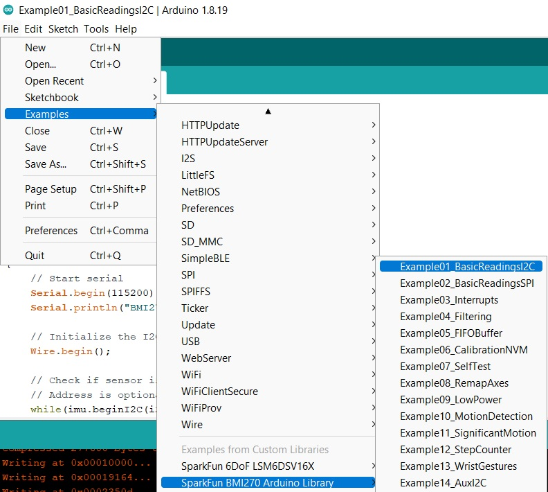
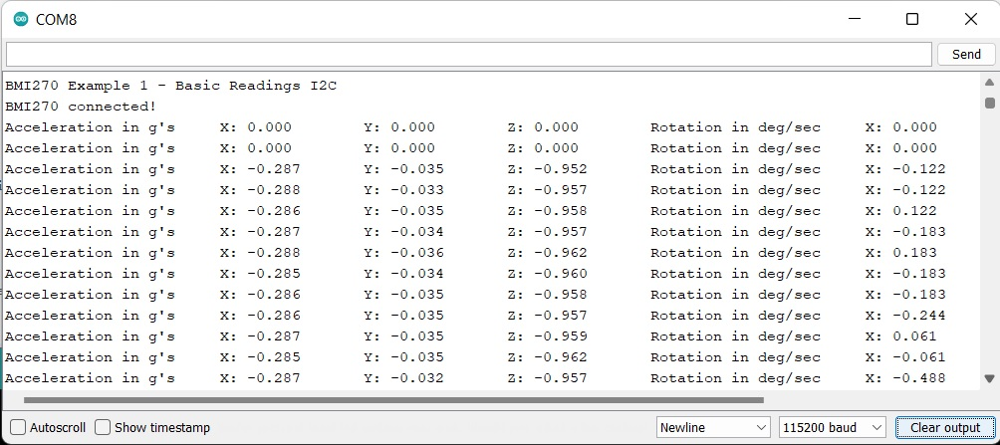
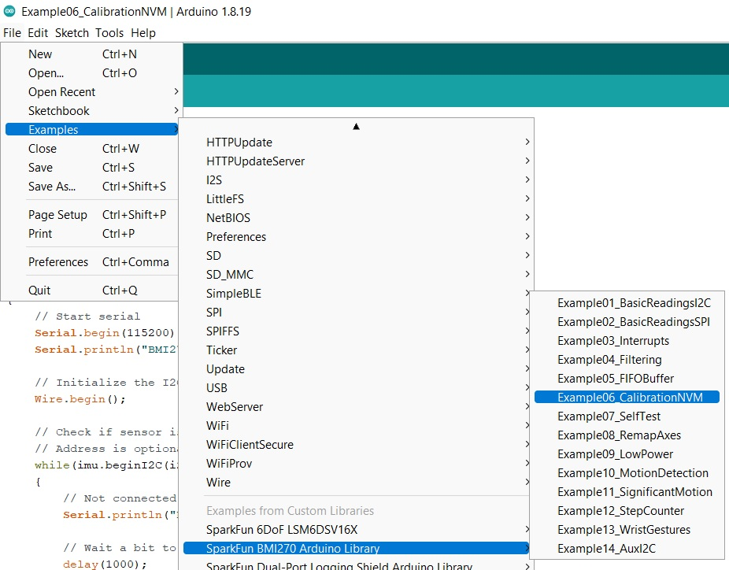
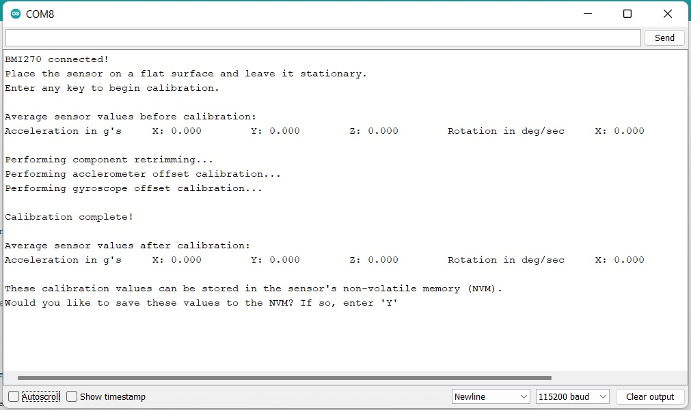
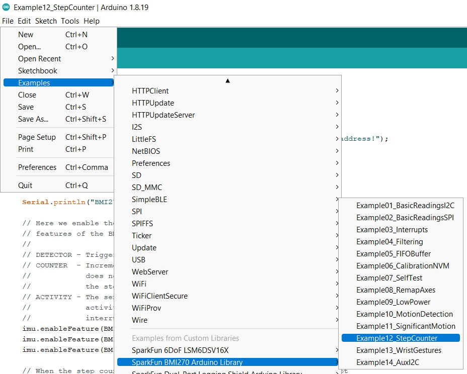
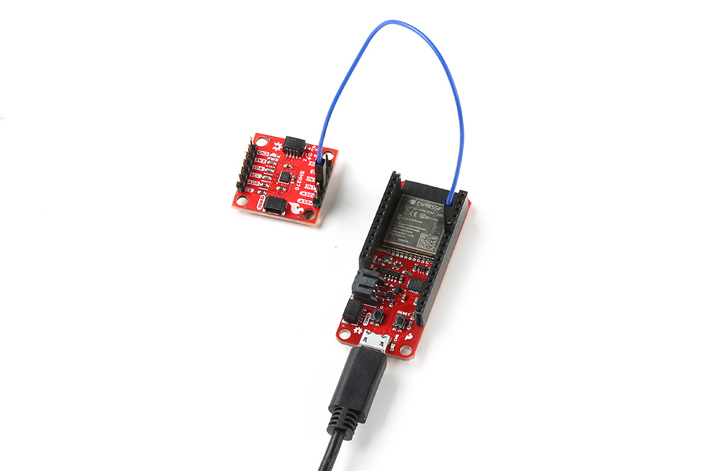
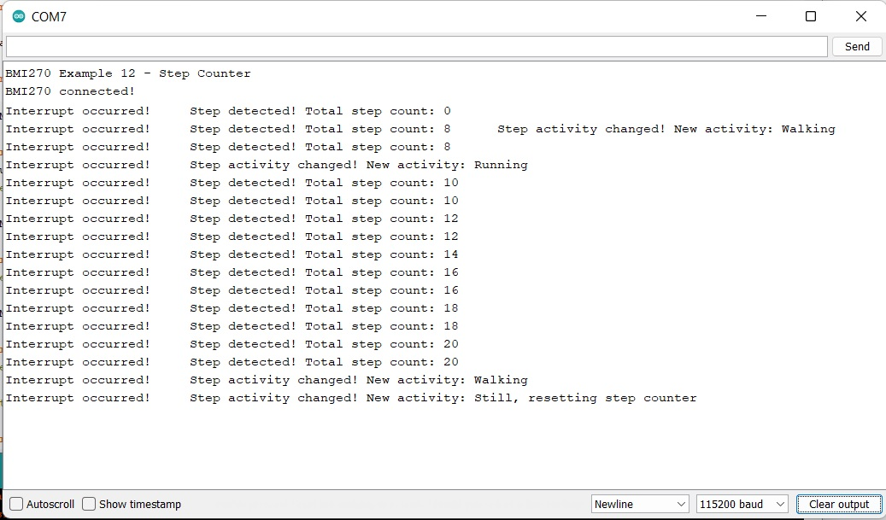

The Arduino Library for the SparkFun 6DoF BMI270 (Qwiic) comes with a slew of examples to get you going. Here we'll just look at a few. 

!!! attention
    <p>The BMI270 chip requires an 8kb file to be flashed to memory on the controller. Make sure that whatever controlling board you use, it has enough space. </p>


###Example 1: Basic Readings

This first example just does some basic measurements. To find Example 1, go to **File** > **Examples** > **SparkFun BMI270 Arduino Library** > **Example01_BasicReadingsI2C**:


<figure markdown>
[{ width="90%" }](assets/imgs/Example1_Menu.jpg "Click to enlarge")
<figcaption markdown>Finding Example 1</figcaption>
</figure>

Alternatively, you can expand the link below and copy and paste the code into a shiny new Arduino sketch: 

??? "Example 1 Arduino Code"
	```
	--8<-- "https://raw.githubusercontent.com/sparkfun/SparkFun_STTS22H_Arduino_Library/main/examples/example1-basic/example1-basic.ino"
	```

<!-- 
	https://raw.githubusercontent.com/sparkfun/SparkFun_BMI270_Arduino_Library/main/examples/Example01_BasicReadingsI2C/Example01_BasicReadingsI2C.ino
-->

Make sure you've selected the correct board and port in the Tools menu and then hit the upload button. Once the code has finished uploading, go ahead and open a [Serial Monitor](https://learn.sparkfun.com/tutorials/terminal-basics). You should see something similar to the following. 

<figure markdown>
[{ width="90%" }](assets/imgs/Example1_Output.jpg "Click to enlarge")
<figcaption markdown>Example 1 Output</figcaption>
</figure>


###Example 6: Calibration to NVM

This example does some basic calibration of the BMI270 and then allows you to write those calibrations to non volatile memory. To find Example 6, go to **File** > **Examples** > **SparkFun BMI270 Arduino Library** > **Example06_CalibrationNVM**. 

<figure markdown>
[{ width="90%" }](assets/imgs/Example6_Menu.jpg "Click to enlarge")
<figcaption markdown>Finding Example 6</figcaption>
</figure>

Alternatively, you can expand the link below and copy and paste the code into a shiny new Arduino sketch: 


??? "Example 6 Arduino Code"
	```
	--8<-- "https://raw.githubusercontent.com/sparkfun/SparkFun_STTS22H_Arduino_Library/main/examples/example1-basic/example1-basic.ino"
	```


<!-- 
	https://raw.githubusercontent.com/sparkfun/SparkFun_BMI270_Arduino_Library/main/examples/Example06_CalibrationNVM/Example06_CalibrationNVM.ino
-->

Again, make sure you've selected the correct board and port in the Tools menu and then hit the upload button. Once the code has finished uploading, go ahead and open a [Serial Monitor](https://learn.sparkfun.com/tutorials/terminal-basics). You should see something similar to the following.

<figure markdown>
[{ width="90%" }](assets/imgs/Example6_Output.jpg "Click to enlarge")
<figcaption markdown>Example 6 Output</figcaption>
</figure>

!!! attention
	This chip only allows a total of 14 writes. Be mindful of this limit when recalibrating. 


###Example 12: Step Counter

 One of the highlights of the BMI270 chip is that it filters out general noise to give you accurate step counts and the like. This example shows the measurements of the BMI270 for walking, running, and when the breakout board is set back down. To find Example 12, go to **File** > **Examples** > **SparkFun BMI270 Arduino Library** > **Example12_StepCounter**:

<figure markdown>
[{ width="90%" }](assets/imgs/Example12_Menu.jpg "Click to enlarge")
<figcaption markdown>Finding Example 12</figcaption>
</figure>

Alternatively, you can expand the link below and copy and paste the code into a shiny new Arduino sketch: 


??? "Example 12 Arduino Code"
	```
	--8<-- "https://raw.githubusercontent.com/sparkfun/SparkFun_STTS22H_Arduino_Library/main/examples/example1-basic/example1-basic.ino"
	```

<!-- 
https://raw.githubusercontent.com/sparkfun/SparkFun_BMI270_Arduino_Library/main/examples/Example12_StepCounter/Example12_StepCounter.ino

-->

The wiring for this example is fairly simple. Use the Qwiic connector as normal, and then you'll need to connect your INT1 pin to pin 5/SCK on the ESP32 Thing Plus. Here's what it looks like:

<figure markdown>
[{ width="90%" }](assets/imgs/Example12_Hookup.jpg "Click to enlarge")
<figcaption markdown>Example 12</figcaption>
</figure>

Once you get the correct port and board selected and the code is uploaded, you should see something like the following: 

<figure markdown>
[{ width="90%" }](assets/imgs/Example12_Output.jpg "Click to enlarge")
<figcaption markdown>Example 12 Output</figcaption>
</figure>


