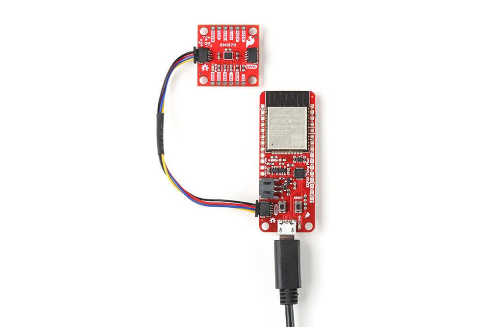
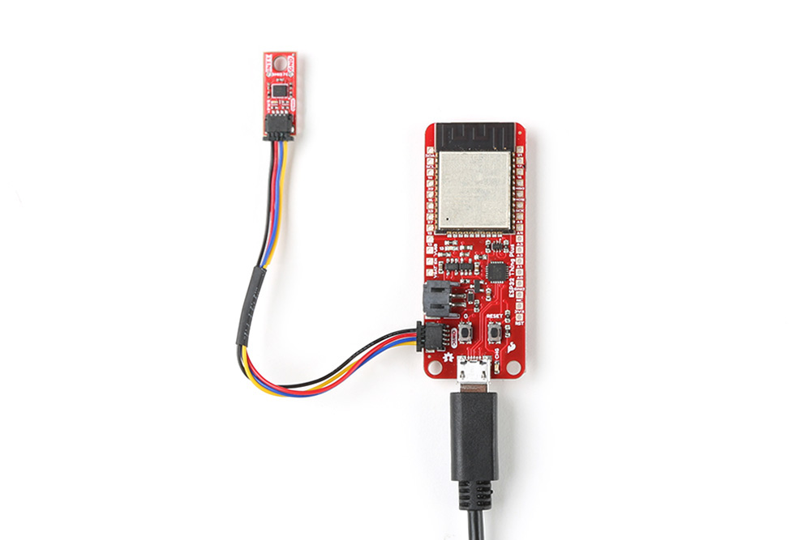

The delightful thing about our Qwiic boards is that they are quite literally plug and play. 

<figure markdown>
[{ width="400" }](assets/imgs/22397_BMI270-Hookup.jpg "Click to enlarge")
<figcaption markdown>SparkFun 6DoF IMU Breakout - BMI270 (Qwiic) Plugged into the ESP32 Thing Plus</figcaption>
</figure>

<figure markdown>
[{ width="400" }](assets/imgs/22398_BMI270-Micro-Hookup.jpg "Click to enlarge")
<figcaption markdown>SparkFun Micro 6DoF IMU Breakout - BMI270 (Qwiic) Plugged into the ESP32 Thing Plus</figcaption>
</figure>
