###Accelerometer - BMI270

The BMI270 

The ultra-low power BMI270 is an IMU optimized for wearables providing precise acceleration, angular rate measurement and intelligent on-chip motion-triggered interrupt features.

The 6-axis sensor combines a 16-bit tri-axial gyroscope and a 16-bit tri-axial accelerometer featuring Bosch’s automotive-proven gyroscope technology. BMI270 includes several functionalities such as an integrated plug-and-play step counter/detector for wrist-worn devices. Moreover, the IMU is suitable for hearables, smart clothes, smart shoes, smart glasses and ankle bands.

<table class="pdf" style="border-style:none;" markdown="1">
<tbody markdown="1">
<tr markdown="1">
<td align="center" width="35%" markdown="block">
[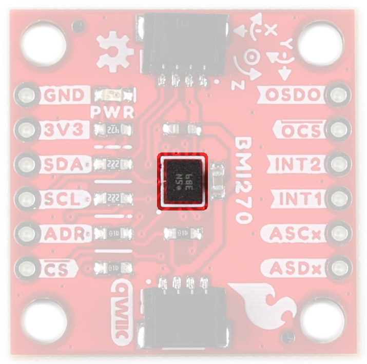{ width=90% }](assets/imgs/22397_Qwiic_6DoF_BMI270_BMI270.jpg)
<figcaption markdown>6DoF BMI270 IC</figcaption>
</td>
<td align="center" width="35%" markdown="block">
[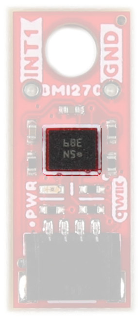{ width=40% }](assets/imgs/22398_Qwiic_Micro_6DoF_BMI270_BMI270.jpg)
<figcaption markdown>Micro 6DoF BMI270 IC</figcaption>
</td>
</tr>
<tr>

</tr>
</tbody>
</table>

###Qwiic Connector

The Qwiic connector(s) on the SparkFun 6DoF - BMI270 (Qwiic) and SparkFun 6DoF Micro - BMI270 (Qwiic) provide power and I2C connectivity simultaneously.

<table class="pdf" style="border-style:none;" markdown="1">
<tbody markdown="1">
<tr markdown="1">
<td align="center" width="35%" markdown="block">
[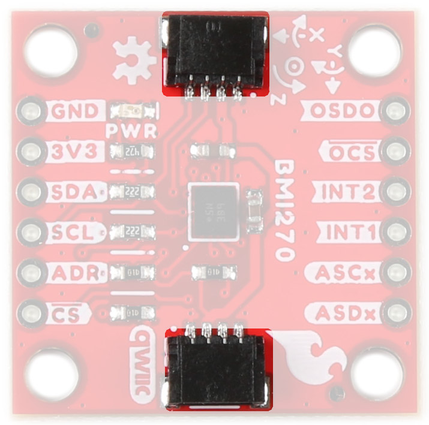{ width=90% }](assets/imgs/22397_Qwiic_6DoF_BMI270_QwiicConnex.jpg)
<figcaption markdown>6DoF BMI270 Qwiic Connector</figcaption>
</td>
<td align="center" width="35%" markdown="block">
[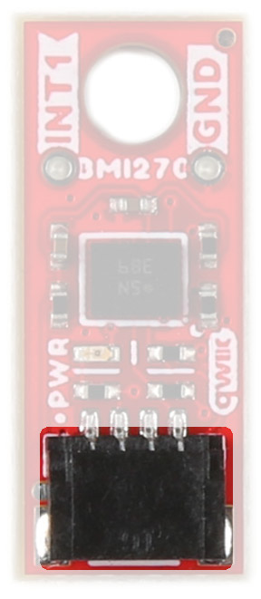{ width=40% }](assets/imgs/22398_Qwiic_Micro_6DoF_BMI270_QwiicConnex.jpg)
<figcaption markdown>Micro 6DoF BMI270 Qwiic Connector</figcaption>
</td>
</tr>
</tbody>
</table>

###Power

Ideally, power to these boards will be provided by the Qwiic cables. However, should you wish to provide power separately, the 1" x 1" board has its pins broken out to PTH and you can wire up power via these. 

!!! warning
    
Make sure to pay attention to logic levels - supply voltage range should be between 1.71V - 3.6V. 

<figure markdown>
[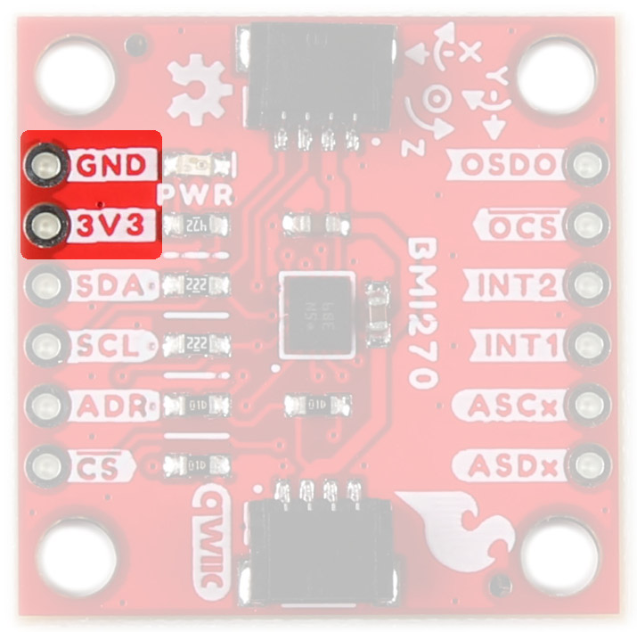{ width="400" }](assets/imgs/22397_Qwiic_6DoF_BMI270_PowerGPIO.jpg" Click to enlarge")
<figcaption markdown>BMI270 Power Pins</figcaption>
</figure>

###GPIO

This is a quick overview of the pin functionality. For more information, refer to the [datasheet](assets/BoardFiles/BMI270-Datasheet.pdf).

#### I2C

If you do not want to use the Qwiic connectors, I2C functionality has been broken out to PTH pins on the 1x1" board. 

<figure markdown>
[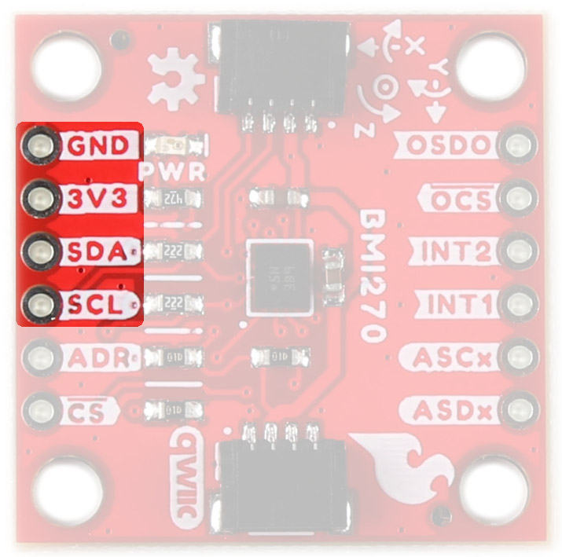{ width="400" }](assets/imgs/22397_Qwiic_6DoF_BMI270_I2CPins.jpg" Click to enlarge")
<figcaption markdown>BMI270 I2C Pins</figcaption>
</figure>

#### SPI

Primary SPI functionality has been broken out to the highlighted pins below. 

<figure markdown>
[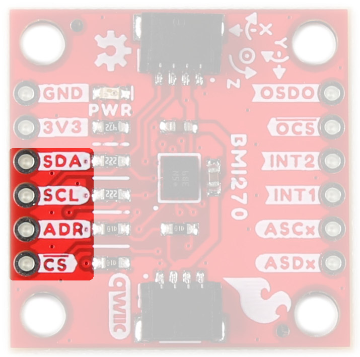{ width="400" }](assets/imgs/22397_Qwiic_6DoF_BMI270_SPIPins.jpg" Click to enlarge")
<figcaption markdown>BMI270 SPI Pins</figcaption>
</figure>

#### Auxiliary Interface 

The ASDx and ASCx pins can be used as a secondary I2C interface where an external sensor like a magnetometer can be connected as a peripheral to the device. 

<figure markdown>
[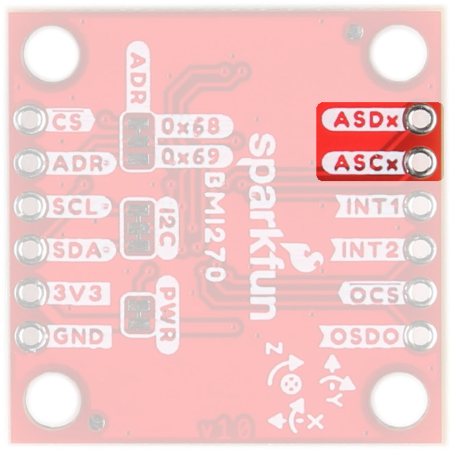{ width="400" }](assets/imgs/22397_Qwiic_6DoF_BMI270_AuxI2CPins.jpg" Click to enlarge")
<figcaption markdown>BMI270 Aux I2C Pins</figcaption>
</figure>

OSCB and OSDO can act as an auxiliary SPI interface where an external controller can be connected to the device. That can include an external OIS control unit. For more information on implementing the OIS interface, see the [Datasheet](assets/BoardFiles/BMI270-Datasheet.pdf). 

<figure markdown>
[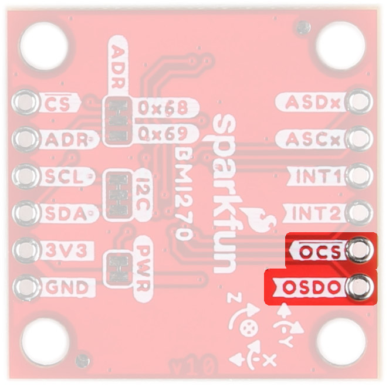{ width="400" }](assets/imgs/22397_Qwiic_6DoF_BMI270_AuxSPIPins.jpg" Click to enlarge")
<figcaption markdown>BMI270 Aux SPI Pins</figcaption>
</figure>

#### Interrupt Pins

Interrupt functionality is available via the INT pins. There are two interrupts available on the 1x1" board, and 1 interrupt available on the Micro. These pins are configurable to be high or low. 

<table class="pdf" style="border-style:none;" markdown="1">
<tbody markdown="1">
<tr markdown="1">
<td align="center" width="35%" markdown="block">
[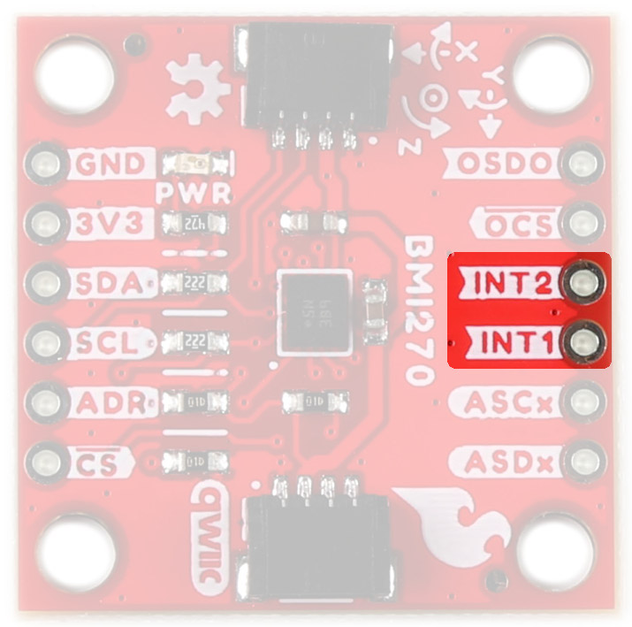{ width=90% }](assets/imgs/22397_Qwiic_6DoF_BMI270_InterruptPins.jpg)
<figcaption markdown>6DoF BMI270 Interrupt Pins</figcaption>
</td>
<td align="center" width="35%" markdown="block">
[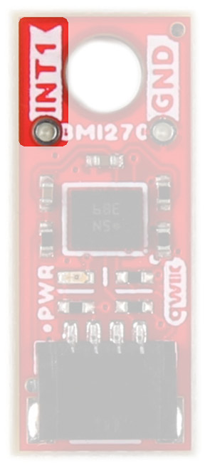{ width=40% }](assets/imgs/22398_Qwiic_Micro_6DoF_BMI270_INTPin.jpg)
<figcaption markdown>Micro 6DoF BMI270 Interrupt Pin</figcaption>
</td>
</tr>
</tbody>
</table>

###Jumpers 

####I2C

Like our other Qwiic boards, the Qwiic 6DoF - BMI270 boards come equipped with pull-up resistors on the clock and data pins. If you are daisy-chaining multiple Qwiic devices, you will want to cut this jumper; if multiple sensors are connected to the bus with the pull-up resistors enabled, the parallel equivalent resistance will create too strong of a pull-up for the bus to operate correctly. As a general rule of thumb, disable all but one pair of pull-up resistors if multiple devices are connected to the bus. To disable the pull up resistors, use an X-acto knife to cut the joint between the two jumper pads highlighted below.

<table class="pdf" style="border-style:none;" markdown="1">
<tbody markdown="1">
<tr markdown="1">
<td align="center" width="35%" markdown="block">
[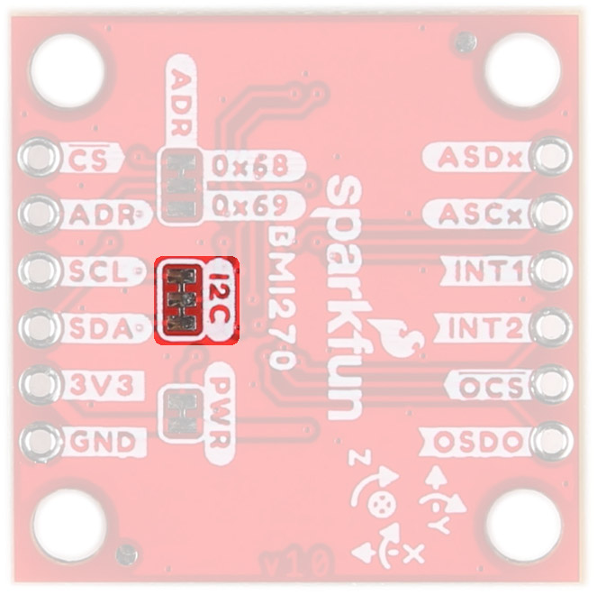{ width=90% }](assets/imgs/22397_Qwiic_6DoF_BMI270_I2CJumper.jpg)
<figcaption markdown>6DoF BMI270 I2C Jumper</figcaption>
</td>
<td align="center" width="35%" markdown="block">
[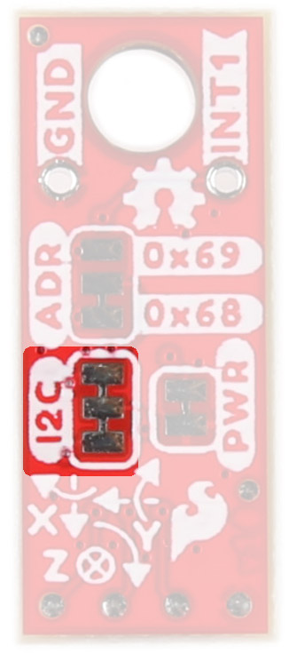{ width=40% }](assets/imgs/22398_Qwiic_Micro_6DoF_BMI270_I2CJumper.jpg)
<figcaption markdown>Micro 6DoF BMI270 I2C Jumper</figcaption>
</td>
</tr>
</tbody>
</table>

####I2C Address

The SparkFun 6DoF - BMI270 (Qwiic) boards have a default I2C address of 0x68, but by cutting the address jumper on the back of the board, you can select 0x69 (GND) or SPI (fully open). 

<table class="pdf" style="border-style:none;" markdown="1">
<tbody markdown="1">
<tr markdown="1">
<td align="center" width="35%" markdown="block">
[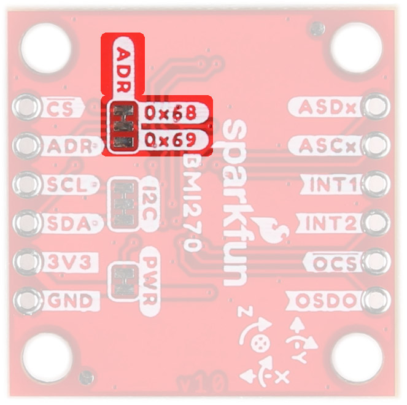{ width=90% }](assets/imgs/22397_Qwiic_6DoF_BMI270_ADDRJumper.jpg)
<figcaption markdown>6DoF BMI270 I2C Address Jumper</figcaption>
</td>
<td align="center" width="35%" markdown="block">
[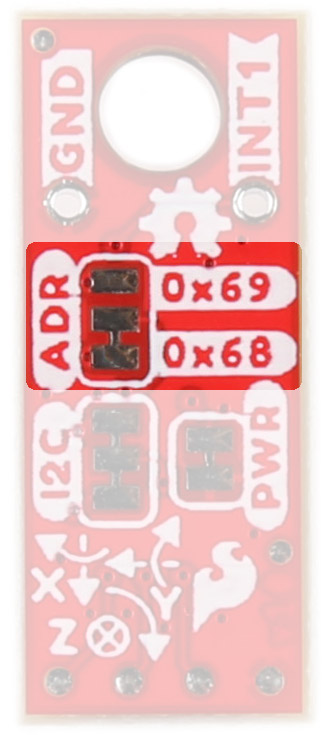{ width=40% }](assets/imgs/22398_Qwiic_Micro_6DoF_BMI270_ADDRJumper.jpg)
<figcaption markdown>Micro 6DoF BMI270 I2C Address Jumper</figcaption>
</td>
</tr>
</tbody>
</table>

####LED

An LED on the front of each board indicates power is being provided to the board. If you don't like LEDs or you are concerned about current draw, cut the jumper highlighted below. 

<table class="pdf" style="border-style:none;" markdown="1">
<tbody markdown="1">
<tr markdown="1">
<td align="center" width="35%" markdown="block">
[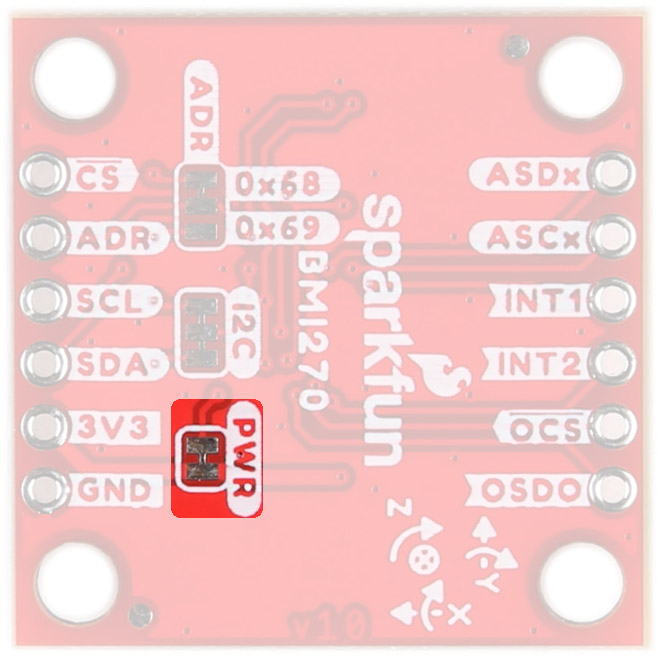{ width=90% }](assets/imgs/22397_Qwiic_6DoF_BMI270_LEDJumper.jpg)
<figcaption markdown>6DoF BMI270 LED Jumper</figcaption>
</td>
<td align="center" width="35%" markdown="block">
[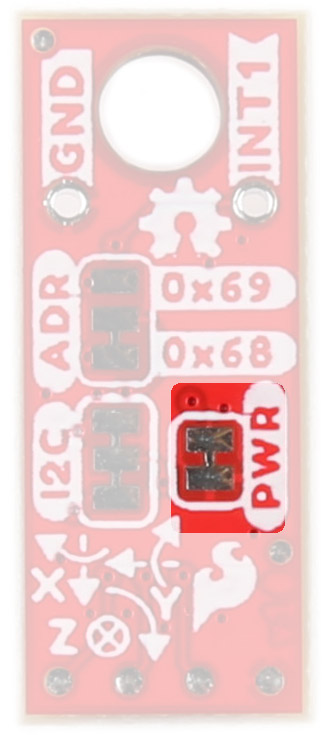{ width=40% }](assets/imgs/22398_Qwiic_Micro_6DoF_BMI270_PWRJumper.jpg)
<figcaption markdown>Micro 6DoF BMI270 LED Jumper</figcaption>
</td>
</tr>
</tbody>
</table>

###Board Outline

The SparkFun 6DoF - BMI270 (Qwiic) follows the standard 1" x 1" convention of most of our Qwiic breakout boards. 

<figure markdown>
[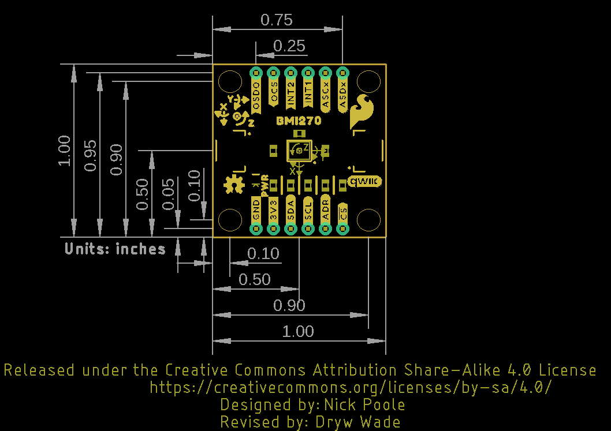{ width=90% }](assets/BoardFiles/SparkFun_Qwiic_6DoF_BMI270-BoardOutline.png "Click to enlarge")
<figcaption markdown>SparkFun 6DoF - BMI270 (Qwiic)</figcaption>
</figure>

The SparkFun 6DoF Micro - BMI270 (Qwiic) measures 0.3" x 0.75". 

<figure markdown>
[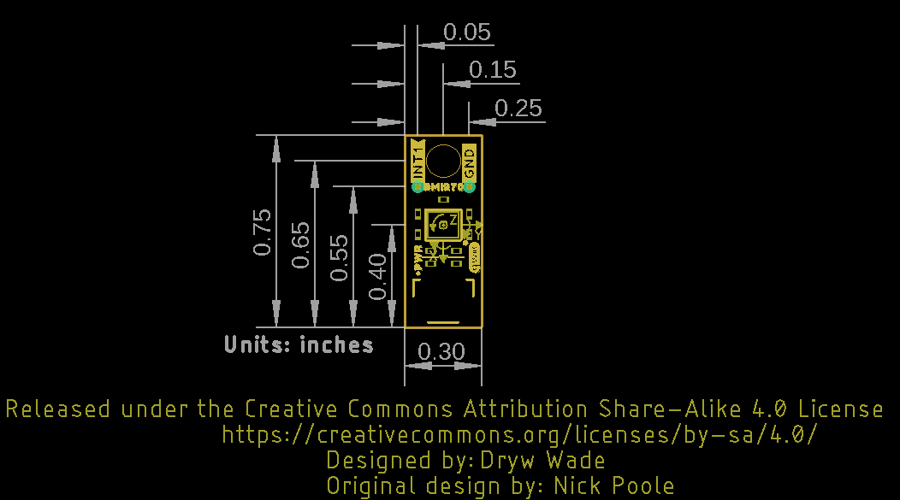{ width=90% }](assets/BoardFiles/SparkFun_Qwiic_6DoF_Micro_BMI270-BoardOutline.png "Click to enlarge")
<figcaption markdown>SparkFun 6DoF Micro - BMI270 (Qwiic)</figcaption>
</figure>

